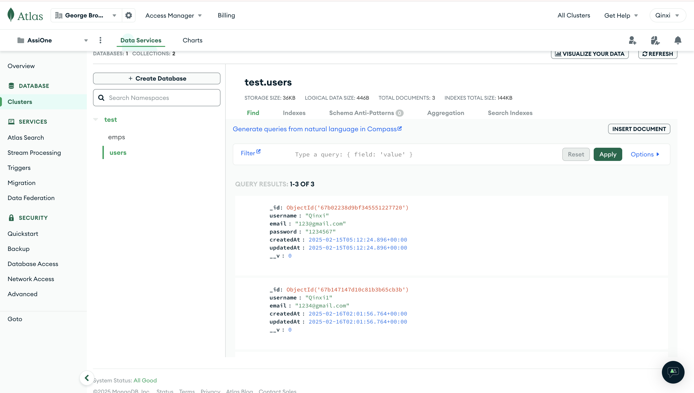
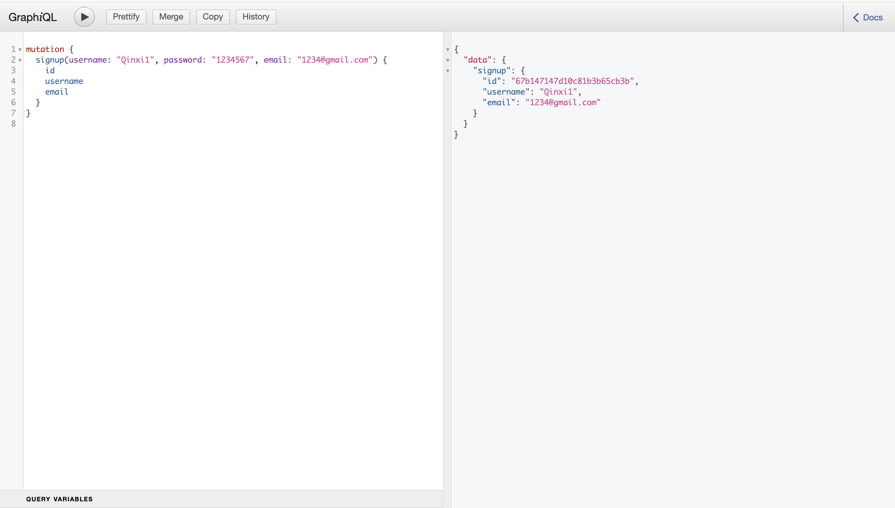
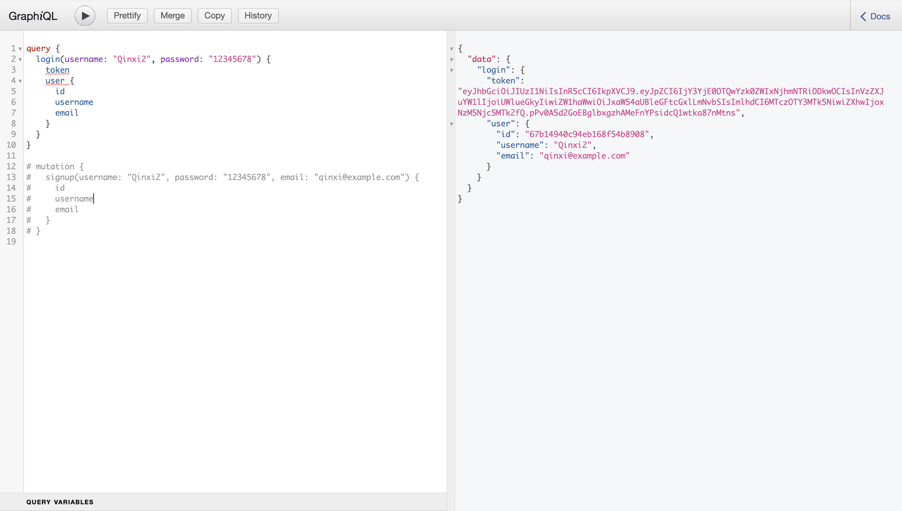
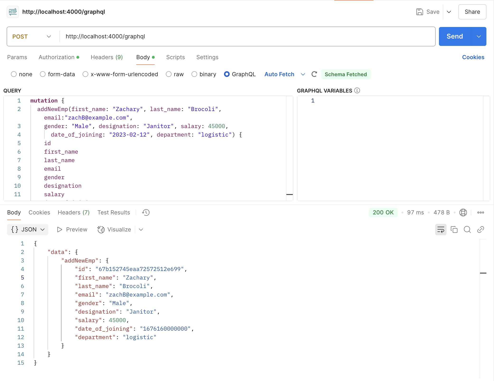
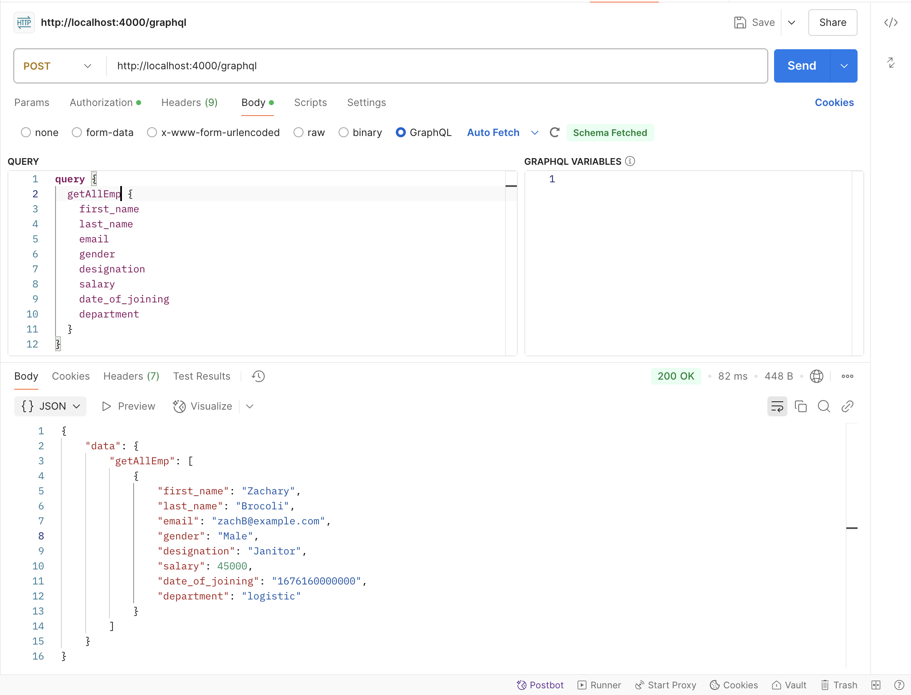
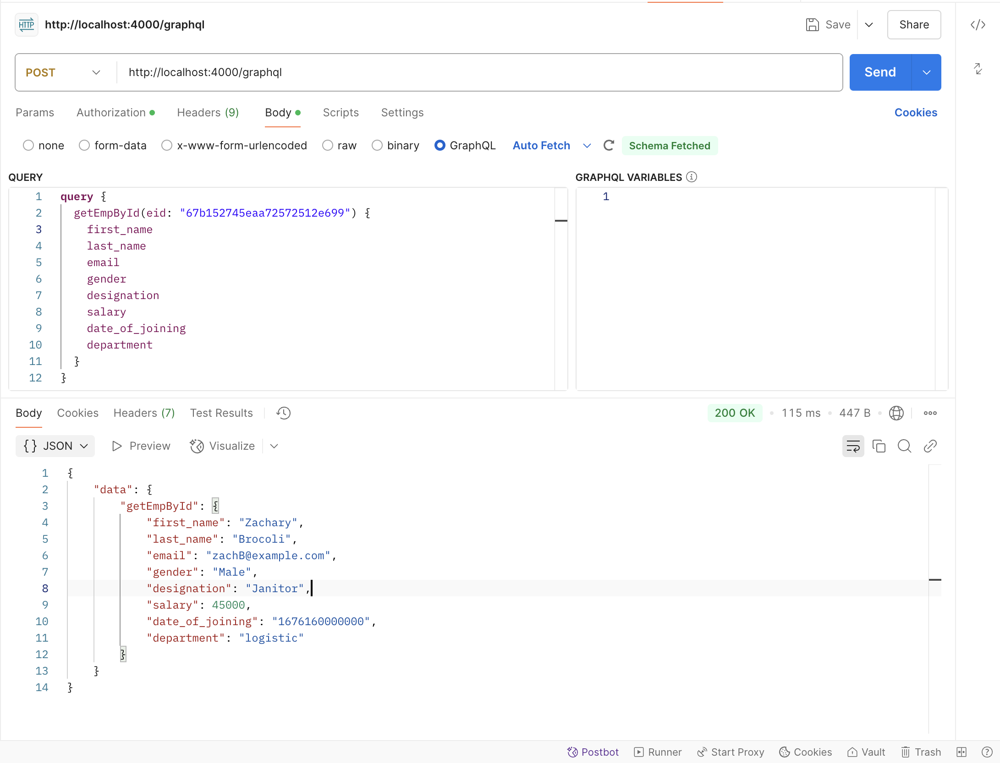
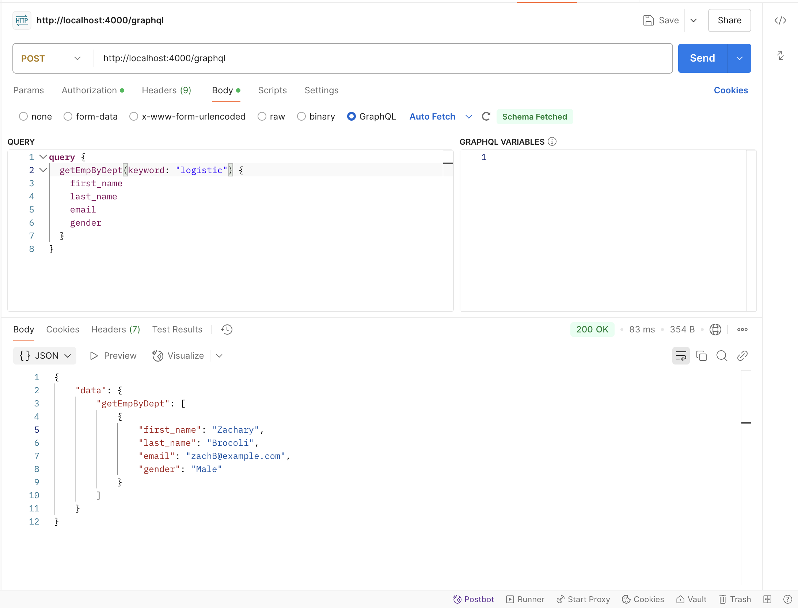
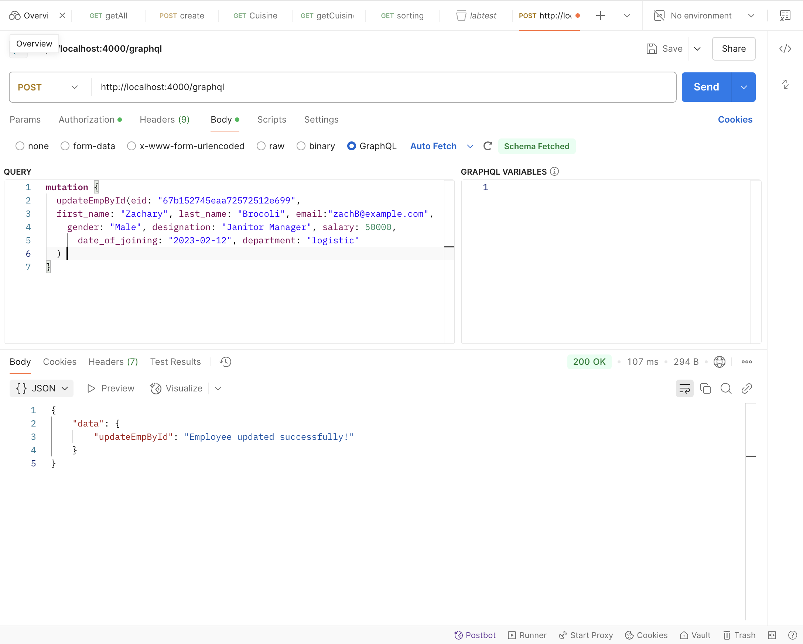
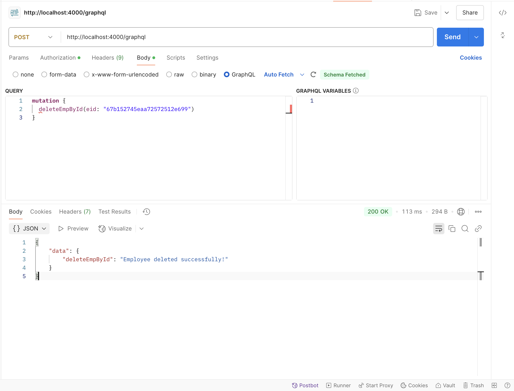

## COMP 3133 – Full Stack Development – II
## Assignment One

Postman Testing Screenshots

MongoDb Colletion

User Sign Up

User Login

Add New Employee

Get All Employees

Get One Employee By Id

Get Employees By Department or Designation

Update One Employee Info 

Delete One Employee By Id
